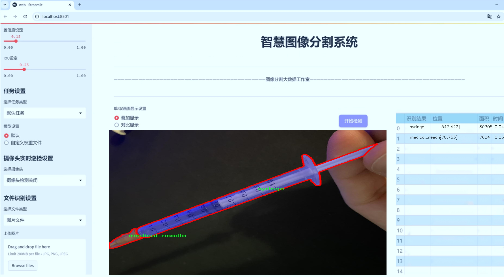
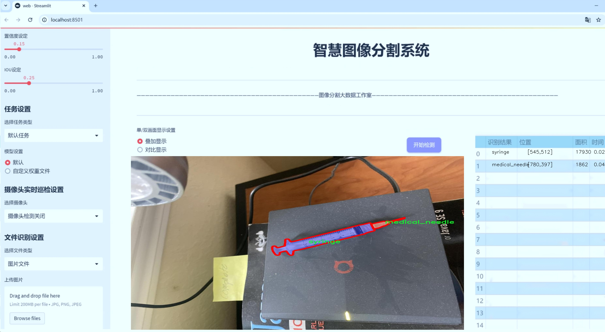
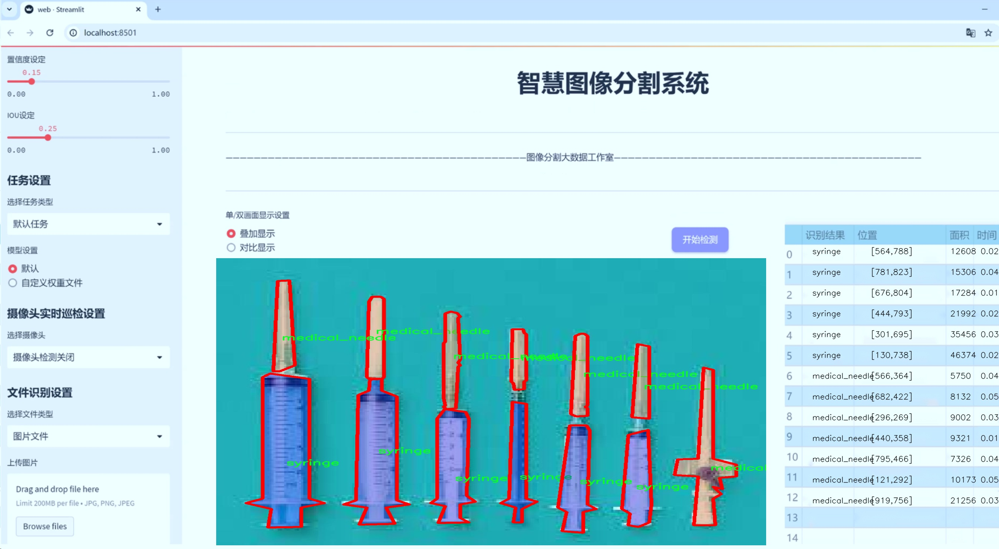
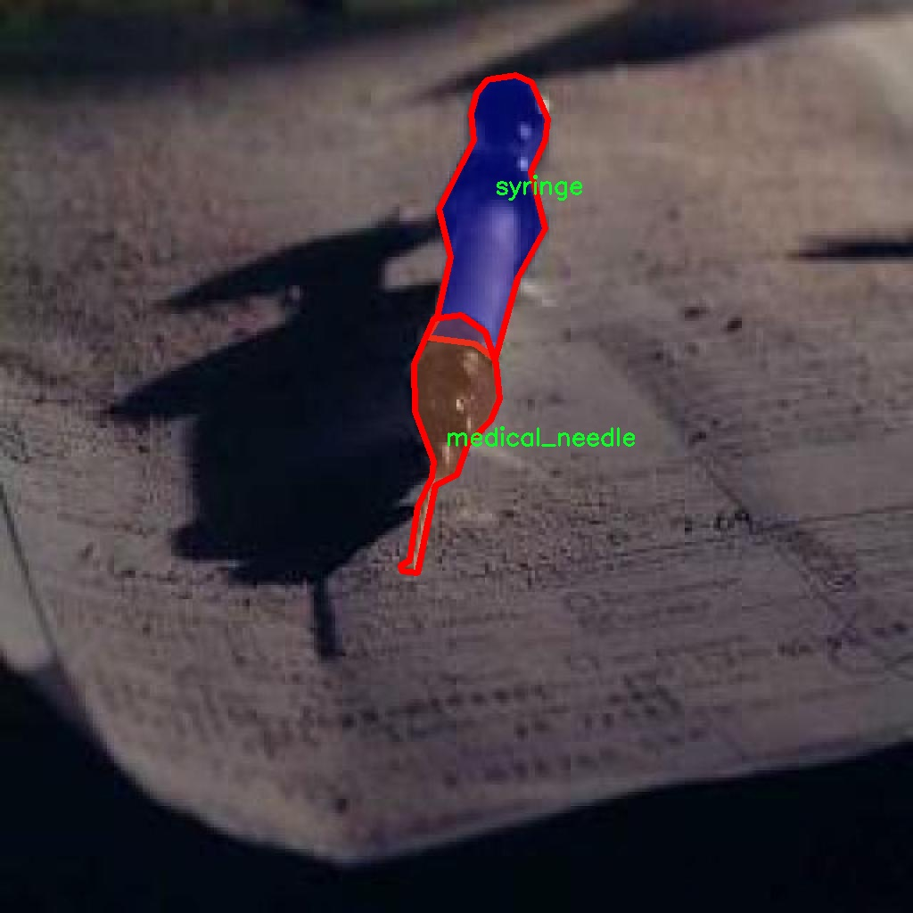
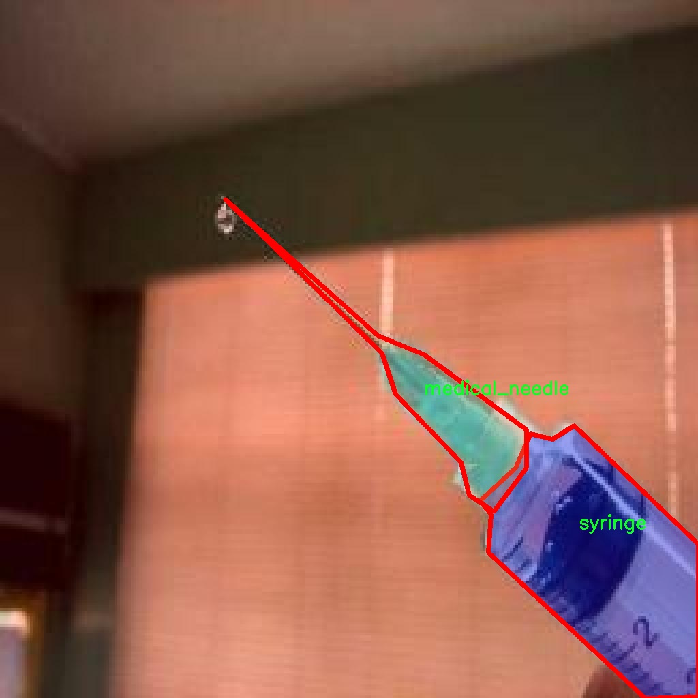
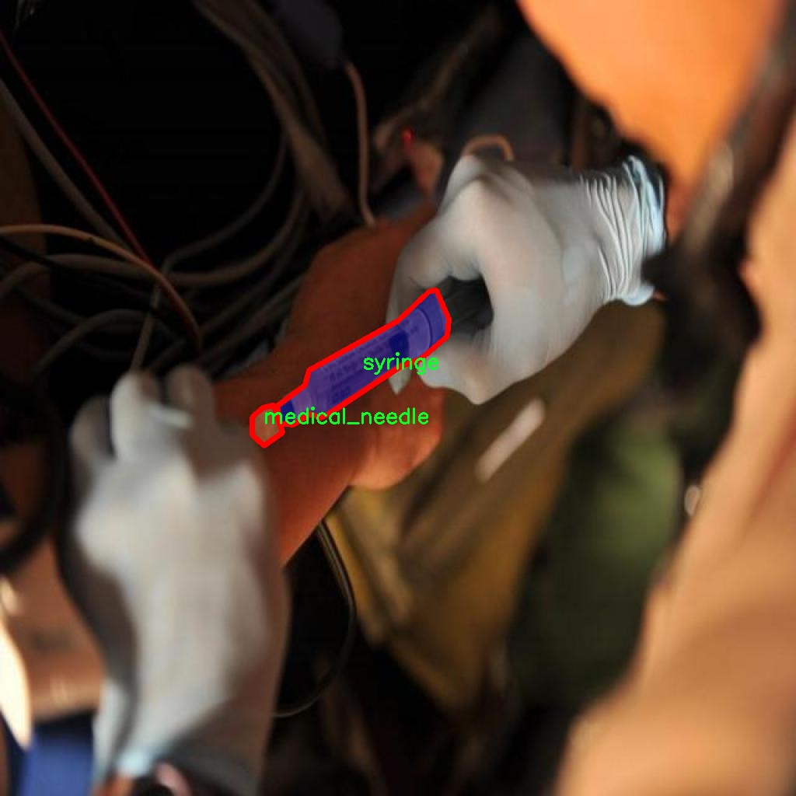
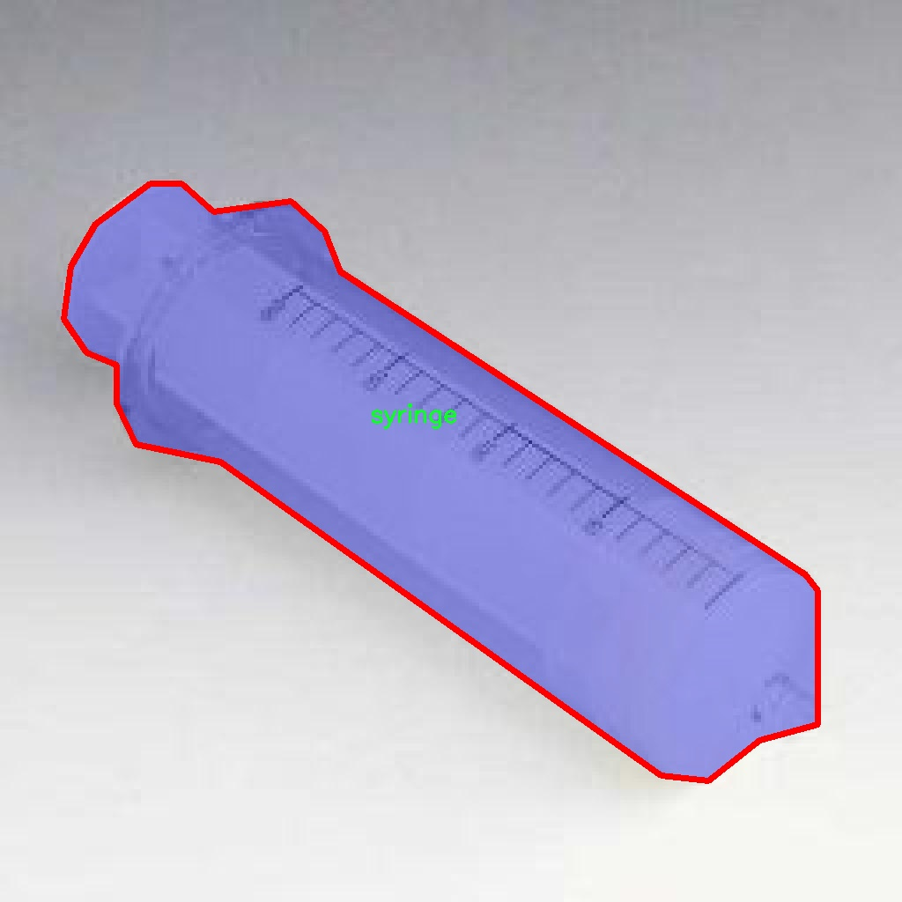
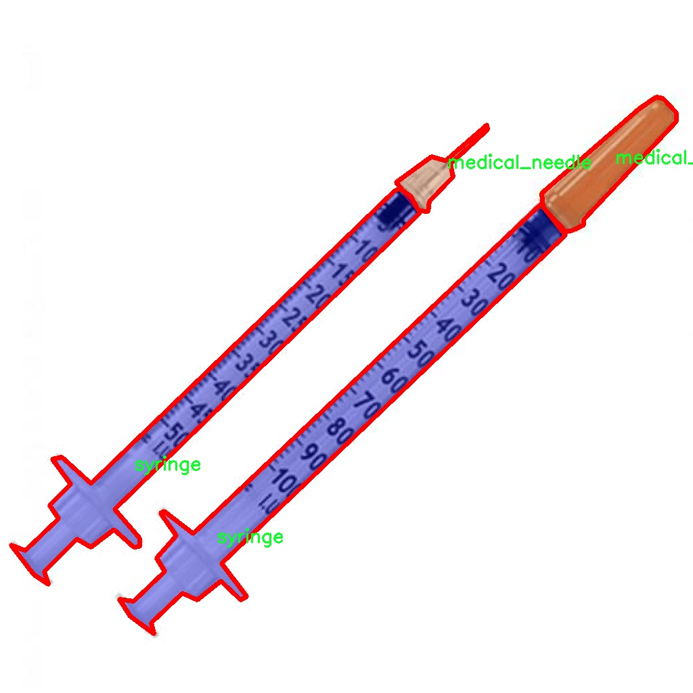

# 注射器和针头识别图像分割系统源码＆数据集分享
 [yolov8-seg-CSwinTransformer＆yolov8-seg-C2f-DiverseBranchBlock等50+全套改进创新点发刊_一键训练教程_Web前端展示]

### 1.研究背景与意义

项目参考[ILSVRC ImageNet Large Scale Visual Recognition Challenge](https://gitee.com/YOLOv8_YOLOv11_Segmentation_Studio/projects)

项目来源[AAAI Global Al lnnovation Contest](https://kdocs.cn/l/cszuIiCKVNis)

研究背景与意义

随着医疗技术的不断进步，注射器和针头作为常见的医疗器械，其使用频率日益增加。准确识别和分割注射器与针头的图像，对于提高医疗设备的自动化管理、提升医疗服务的效率以及保障患者安全具有重要意义。近年来，计算机视觉技术的发展，尤其是深度学习算法的广泛应用，为图像识别和分割任务提供了新的解决方案。其中，YOLO（You Only Look Once）系列模型因其高效的实时检测能力而受到广泛关注。YOLOv8作为该系列的最新版本，具备更强的特征提取能力和更快的处理速度，为医疗图像的分析提供了良好的基础。

在实际应用中，注射器和针头的识别面临诸多挑战。首先，医疗环境中光照条件复杂，可能导致图像质量下降，影响识别效果。其次，注射器和针头的形状、颜色和材质多样，容易与背景混淆，增加了识别的难度。此外，注射器和针头的尺寸变化也可能影响模型的识别准确性。因此，基于YOLOv8的改进方法，能够有效应对这些挑战，提升图像分割的精度和鲁棒性。

本研究使用的数据集“syringe_31_08”包含1200张注射器和针头的图像，涵盖了两个主要类别：医疗针头和注射器。这一数据集的构建为模型的训练和验证提供了丰富的样本，确保了模型在不同场景下的适应性和准确性。通过对该数据集的深入分析和处理，能够为改进YOLOv8模型提供必要的基础数据支持，进而提升其在医疗图像分割任务中的表现。

本研究的意义不仅在于提升注射器和针头的识别精度，更在于推动医疗图像处理技术的发展。通过改进YOLOv8模型，研究者可以探索更为高效的图像分割算法，进而为医疗行业提供更为智能化的解决方案。此外，研究成果可为其他医疗器械的自动识别与管理提供借鉴，推动智能医疗设备的普及与应用。

综上所述，基于改进YOLOv8的注射器和针头识别图像分割系统的研究，不仅具有重要的理论价值，还具有广泛的实际应用前景。通过提升医疗图像处理的自动化水平，能够有效减少人工操作的错误，提高医疗服务的质量与效率，为患者提供更安全、便捷的医疗体验。随着智能医疗的不断发展，本研究将为相关领域的研究者提供新的思路和方法，推动医疗技术的进步与创新。

### 2.图片演示







##### 注意：由于此博客编辑较早，上面“2.图片演示”和“3.视频演示”展示的系统图片或者视频可能为老版本，新版本在老版本的基础上升级如下：（实际效果以升级的新版本为准）

  （1）适配了YOLOV8的“目标检测”模型和“实例分割”模型，通过加载相应的权重（.pt）文件即可自适应加载模型。

  （2）支持“图片识别”、“视频识别”、“摄像头实时识别”三种识别模式。

  （3）支持“图片识别”、“视频识别”、“摄像头实时识别”三种识别结果保存导出，解决手动导出（容易卡顿出现爆内存）存在的问题，识别完自动保存结果并导出到tempDir中。

  （4）支持Web前端系统中的标题、背景图等自定义修改，后面提供修改教程。

  另外本项目提供训练的数据集和训练教程,暂不提供权重文件（best.pt）,需要您按照教程进行训练后实现图片演示和Web前端界面演示的效果。

### 3.视频演示

[3.1 视频演示](https://www.bilibili.com/video/BV1FLDwYuEjs/)

### 4.数据集信息展示

##### 4.1 本项目数据集详细数据（类别数＆类别名）

nc: 2
names: ['medical_needle', 'syringe']


##### 4.2 本项目数据集信息介绍

数据集信息展示

在本研究中，我们使用了名为“syringe_31_08”的数据集，以支持改进YOLOv8-seg的注射器和针头识别图像分割系统的训练与评估。该数据集专门设计用于医疗图像处理，涵盖了与注射器和针头相关的图像分割任务，具有重要的应用价值。数据集的类别数量为2，具体类别包括“medical_needle”（医疗针头）和“syringe”（注射器）。这两个类别的选择不仅反映了医疗器械在临床环境中的重要性，也为计算机视觉算法在医学领域的应用提供了丰富的训练样本。

“syringe_31_08”数据集包含多样化的图像样本，涵盖了不同类型和形状的注射器及针头，确保了模型在各种场景下的鲁棒性和准确性。数据集中的图像来源于真实的医疗环境，具有较高的真实性和代表性。这些图像经过精心标注，确保每个注射器和针头的边界都被准确地框定，便于后续的图像分割任务。通过对这些图像的分析和处理，模型能够学习到注射器和针头的特征，从而在实际应用中实现高效的识别和分割。

在数据集的构建过程中，研究团队采用了多种图像采集技术，确保数据的多样性和全面性。例如，数据集中包含了不同光照条件、背景环境和拍摄角度下的图像，以模拟真实世界中可能遇到的各种情况。这种多样性不仅提高了模型的泛化能力，也为模型在实际应用中的稳定性提供了保障。此外，数据集还包含了不同尺寸和颜色的注射器和针头，进一步丰富了训练样本的多样性。

在训练过程中，YOLOv8-seg模型将利用“syringe_31_08”数据集进行迭代学习。通过对图像进行特征提取和分类，模型能够逐步优化其参数，以提高对注射器和针头的识别精度。该模型采用了先进的深度学习算法，结合了卷积神经网络（CNN）和图像分割技术，旨在实现高效、准确的医疗器械识别。这一过程不仅需要大量的计算资源，还需要对数据集进行充分的预处理和增强，以提升模型的学习效果。

总之，“syringe_31_08”数据集为改进YOLOv8-seg的注射器和针头识别图像分割系统提供了坚实的基础。通过对该数据集的深入分析和利用，研究团队期望能够开发出一种高效的图像分割解决方案，进而推动医疗器械自动识别技术的发展。这不仅将为临床操作提供便利，也将为医疗安全和效率的提升做出贡献。未来，随着数据集的不断扩展和优化，模型的性能有望得到进一步提升，为医学影像分析领域带来新的突破。











### 5.全套项目环境部署视频教程（零基础手把手教学）

[5.1 环境部署教程链接（零基础手把手教学）](https://www.bilibili.com/video/BV1jG4Ve4E9t/?vd_source=bc9aec86d164b67a7004b996143742dc)


[5.2 安装Python虚拟环境创建和依赖库安装视频教程链接（零基础手把手教学）](https://www.bilibili.com/video/BV1nA4VeYEze/?vd_source=bc9aec86d164b67a7004b996143742dc)

### 6.手把手YOLOV8-seg训练视频教程（零基础小白有手就能学会）

[6.1 手把手YOLOV8-seg训练视频教程（零基础小白有手就能学会）](https://www.bilibili.com/video/BV1cA4VeYETe/?vd_source=bc9aec86d164b67a7004b996143742dc)


按照上面的训练视频教程链接加载项目提供的数据集，运行train.py即可开始训练



     Epoch   gpu_mem       box       obj       cls    labels  img_size
     1/200     0G   0.01576   0.01955  0.007536        22      1280: 100%|██████████| 849/849 [14:42<00:00,  1.04s/it]
               Class     Images     Labels          P          R     mAP@.5 mAP@.5:.95: 100%|██████████| 213/213 [01:14<00:00,  2.87it/s]
                 all       3395      17314      0.994      0.957      0.0957      0.0843

     Epoch   gpu_mem       box       obj       cls    labels  img_size
     2/200     0G   0.01578   0.01923  0.007006        22      1280: 100%|██████████| 849/849 [14:44<00:00,  1.04s/it]
               Class     Images     Labels          P          R     mAP@.5 mAP@.5:.95: 100%|██████████| 213/213 [01:12<00:00,  2.95it/s]
                 all       3395      17314      0.996      0.956      0.0957      0.0845

     Epoch   gpu_mem       box       obj       cls    labels  img_size
     3/200     0G   0.01561    0.0191  0.006895        27      1280: 100%|██████████| 849/849 [10:56<00:00,  1.29it/s]
               Class     Images     Labels          P          R     mAP@.5 mAP@.5:.95: 100%|███████   | 187/213 [00:52<00:00,  4.04it/s]
                 all       3395      17314      0.996      0.957      0.0957      0.0845


### 7.50+种全套YOLOV8-seg创新点代码加载调参视频教程（一键加载写好的改进模型的配置文件）

[7.1 50+种全套YOLOV8-seg创新点代码加载调参视频教程（一键加载写好的改进模型的配置文件）](https://www.bilibili.com/video/BV1Hw4VePEXv/?vd_source=bc9aec86d164b67a7004b996143742dc)

### 8.YOLOV8-seg图像分割算法原理

原始YOLOv8-seg算法原理

YOLOv8-seg算法是2023年由Ultralytics公司推出的YOLO系列的最新版本，它在YOLOv7的基础上进行了深度优化，旨在提升目标检测和分割的性能。作为一种基于卷积神经网络（CNN）的目标检测算法，YOLOv8-seg的设计理念是将整个图像作为输入，直接在图像上进行目标检测和定位。这种方法避免了传统目标检测算法中常用的滑动窗口或区域提议机制，从而显著提高了检测的精度和速度。

YOLOv8-seg算法的核心在于其深层的卷积神经网络结构，采用了多尺度训练和测试策略，以适应不同大小和形状的目标。这种多尺度的特性使得算法能够在各种复杂场景中表现出色，例如智能监控、自动驾驶以及人脸识别等应用场景。通过特征金字塔网络（FPN）的引入，YOLOv8-seg能够有效地提取不同层次的特征信息，从而增强了对小目标的检测能力。

在YOLOv8-seg中，模型的架构分为三个主要部分：输入端、主干网络和检测端。输入端负责接收图像数据，主干网络则是特征提取的核心，采用了改进的PAN-FPN结构。该结构通过引入C2f模块，取代了YOLOv5中的C3模块，并结合了YOLOv7中的ELAN模块的思想，增加了更多的残差连接。这种设计不仅提高了模型的轻量化程度，还丰富了梯度信息的传递，使得模型在训练过程中能够更有效地学习。

YOLOv8-seg在检测端的创新同样显著。它采用了流行的解耦合头结构，将分类和检测头分离，优化了信息的流动。此外，YOLOv8-seg摒弃了传统的Anchor-Based方法，转而采用Anchor-Free的策略，这一变化使得模型在处理复杂场景时能够更灵活地适应目标的多样性。

在训练过程中，YOLOv8-seg引入了动态Task-Aligned Assigner样本分配策略，这一策略通过动态调整样本的分配方式，提高了训练的效率和效果。同时，在数据增强方面，YOLOv8-seg在训练的最后10个epoch中关闭了马赛克增强，这一策略旨在减少过拟合现象，确保模型的泛化能力。

损失函数的设计也是YOLOv8-seg的一大亮点。算法采用了BCELoss作为分类损失，DFLLoss和CIoULoss作为回归损失。这种组合不仅提高了分类的准确性，还增强了目标定位的精度，使得YOLOv8-seg在各类任务中表现优异。

与前一版本相比，YOLOv8-seg在精度和速度上均有显著提升。通过与SSD等其他目标检测算法的比较，YOLOv8-seg的精度提高了43.23%，帧率则提升了10.28倍。这一性能的提升使得YOLOv8-seg在实际应用中更具竞争力，能够满足实时检测的需求。

YOLOv8-seg的模型设计还考虑到了不同场景的需求，提供了n、s、m、l、x五种不同尺度的模型。这种灵活性使得用户可以根据具体的应用场景选择最合适的模型，从而在保证性能的同时，降低计算资源的消耗。

总的来说，YOLOv8-seg算法通过深度的网络结构、创新的模块设计和高效的训练策略，成功地提升了目标检测和分割的性能。其在各类应用场景中的广泛适用性和卓越的性能，使得YOLOv8-seg成为当前目标检测领域的一项重要技术进展。随着YOLOv8-seg的推广和应用，未来在智能监控、自动驾驶等领域的潜力将进一步被挖掘，为相关行业的发展带来新的机遇。


### 9.系统功能展示（检测对象为举例，实际内容以本项目数据集为准）

图9.1.系统支持检测结果表格显示

  图9.2.系统支持置信度和IOU阈值手动调节

  图9.3.系统支持自定义加载权重文件best.pt(需要你通过步骤5中训练获得)

  图9.4.系统支持摄像头实时识别

  图9.5.系统支持图片识别

  图9.6.系统支持视频识别

  图9.7.系统支持识别结果文件自动保存

  图9.8.系统支持Excel导出检测结果数据


### 10.50+种全套YOLOV8-seg创新点原理讲解（非科班也可以轻松写刊发刊，V11版本正在科研待更新）

#### 10.1 由于篇幅限制，每个创新点的具体原理讲解就不一一展开，具体见下列网址中的创新点对应子项目的技术原理博客网址【Blog】：


[10.1 50+种全套YOLOV8-seg创新点原理讲解链接](https://gitee.com/qunmasj/good)

#### 10.2 部分改进模块原理讲解(完整的改进原理见上图和技术博客链接)【如果此小节的图加载失败可以通过CSDN或者Github搜索该博客的标题访问原始博客，原始博客图片显示正常】
### YOLOv8简介
YOLOv8目标检测算法继承了YOLOv1 系列的思考,是一种新型端到端的目标检测算法,尽管现在原始检测算法已经开源,但是鲜有发表的相关论文.YOLOv8的网络结构如图1[1所示,主要可分为Input输入端、Backbone 骨干神经网络、Neck混合特征网络层和 Head预测层网络共4个部分.

输入端( input)方法包含的功能模块有:马赛克( mosaic)数据增强、自适应锚框( anchor)计算、自适应图片缩放和 Mixup 数据增强['6].马赛克数据增强包括3种方式:缩放,色彩空间调整和马赛克增强.
该方法通过将4张图像进行随机的缩放﹑裁剪和打乱分布方式等操作来重新拼接图像,可丰富检测的数据集,具体步骤可见图2.随机缩放增加的许多小目标,非常适于解决卫星数据往往因距离目标过远从而导致图像中几乎都是小目标这一问题.在自适应锚框计算中, YOLO算法在每次训练数据之前,都会根据标注信息自动计算该数据集最合适的锚框尺寸,然后自动匹配最佳锚框.而自适应图片缩放只在检测时使用,由于不同场景需求不同,因而基于缩放系数YOLOv8提供了多尺度的不同大小模型.Mixup 数据增强鼓励模型对训练样本有一个线性的理解,具体做法是在目标检测中将两幅图像的像素值按照图像透明度的通道信息( alpha值)进行线性融合,对于标签box的处理直接采用拼接( con-cat)的方法拼接到一起.


Backbone骨干网络指用来提取图像特征的网络,整体结构包括注意力机制( focus)模块、跨阶段局部网络[ 7] ( cross stage partial network , CSP)和空间金字塔池化结构( spatial pyramid pooling,SPP).其中, Focus模块的作用是在图片进入 Backbone骨干网络前,对图片进行切片操作,即在一张图片中每隔一个像素取一个值,获得4张互补的图片,最后将新生成的图片经过卷积操作,得到没有信息丢失的2倍下采样特征图.YOLOv8使用了CSPNet 中的C2f网络,网络见图3,其中 CBS 就是卷积层,而瓶颈层( bottleneck layer)使用的是1* 1的卷积神经网络.C2f网络在保证轻量化的同时获得更加丰富的梯度流信息.而SPP结构是空间金字塔池化,能将任意大小的特征图转换成固定大小的特征向量,即把输入的特征地图划分为多个尺度,然后对每个图进行最大池化,再将提取的特征值拼接起来成为一维向量,输入SPP层获取分类.


Neck 结构如图4所示,它是由卷积层和C2f模块组成的的网络层,采用了路径聚合网络( path ag-gregation network ,PAN)和特征金字塔网络( featurepyramid networks , FPN)的结构对特征进行多尺度融合,目标是将图像特征传递到预测层.其中 PAN结构指图4左半边,它自底向上进行下采样,使顶层特征包含图像位置信息,两个特征最后进行融合,使不同尺寸的特征图都包含图像语义信息和图像特征信息，保证了网络对不同尺寸的图片的准确预测.而FPN结构指图4右半边,指通过自顶向下进行上采样,将高层特征与底层特征进行融合,从而同时利用低层特征的高分辨率和高层特征的丰富语义信息,并进行了多尺度特征的独立预测,对小物体的检测效果有明显的提升.从 FPN模块的基础上看,它增加了自底向上的特征金字塔结构,保留了更多的浅层位置特征,将整体特征提取能力进一步提升.


Head的结构如图5所示,在该结构中 YOLOv8采用了解耦检测头( decoupled-head )[ 18],因为分类和定位的关注点不同,分类更关注目标的纹理内容而定位更关注目标的边缘信息.因而解耦头结构考虑到分类和定位所关注的内容的不同,采用不同的分支来进行运算,提升了检测效果,相对应的回归头的通道数也改变了.


### MS-Block简介
实时目标检测，以YOLO系列为例，已在工业领域中找到重要应用，特别是在边缘设备（如无人机和机器人）中。与之前的目标检测器不同，实时目标检测器旨在在速度和准确性之间追求最佳平衡。为了实现这一目标，提出了大量的工作：从第一代DarkNet到CSPNet，再到最近的扩展ELAN，随着性能的快速增长，实时目标检测器的架构经历了巨大的变化。

尽管性能令人印象深刻，但在不同尺度上识别对象仍然是实时目标检测器面临的基本挑战。这促使作者设计了一个强大的编码器架构，用于学习具有表现力的多尺度特征表示。具体而言，作者从两个新的角度考虑为实时目标检测编码多尺度特征：

从局部视角出发，作者设计了一个具有简单而有效的分层特征融合策略的MS-Block。受到Res2Net的启发，作者在MS-Block中引入了多个分支来进行特征提取，但不同的是，作者使用了一个带有深度卷积的 Inverted Bottleneck Block块，以实现对大Kernel的高效利用。

从全局视角出发，作者提出随着网络加深逐渐增加卷积的Kernel-Size。作者在浅层使用小Kernel卷积来更高效地处理高分辨率特征。另一方面，在深层中，作者采用大Kernel卷积来捕捉广泛的信息。

基于以上设计原则，作者呈现了作者的实时目标检测器，称为YOLO-MS。为了评估作者的YOLO-MS的性能，作者在MS COCO数据集上进行了全面的实验。还提供了与其他最先进方法的定量比较，以展示作者方法的强大性能。如图1所示，YOLO-MS在计算性能平衡方面优于其他近期的实时目标检测器。


具体而言，YOLO-MS-XS在MS COCO上获得了43%+的AP得分，仅具有450万个可学习参数和8.7亿个FLOPs。YOLO-MS-S和YOLO-MS分别获得了46%+和51%+的AP，可学习参数分别为810万和2220万。此外，作者的工作还可以作为其他YOLO模型的即插即用模块。通常情况下，作者的方法可以将YOLOv8的AP从37%+显著提高到40%+，甚至还可以使用更少的参数和FLOPs。

CSP Block是一个基于阶段级梯度路径的网络，平衡了梯度组合和计算成本。它是广泛应用于YOLO系列的基本构建块。已经提出了几种变体，包括YOLOv4和YOLOv5中的原始版本，Scaled YOLOv4中的CSPVoVNet，YOLOv7中的ELAN，以及RTMDet中提出的大Kernel单元。作者在图2(a)和图2(b)中分别展示了原始CSP块和ELAN的结构。


上述实时检测器中被忽视的一个关键方面是如何在基本构建块中编码多尺度特征。其中一个强大的设计原则是Res2Net，它聚合了来自不同层次的特征以增强多尺度表示。然而，这一原则并没有充分探索大Kernel卷积的作用，而大Kernel卷积已经在基于CNN的视觉识别任务模型中证明有效。将大Kernel卷积纳入Res2Net的主要障碍在于它们引入的计算开销，因为构建块采用了标准卷积。在作者的方法中，作者提出用 Inverted Bottleneck Block替代标准的3 × 3卷积，以享受大Kernel卷积的好处。

#### MS-Block

基于前面的分析，参考该博客提出了一个带有分层特征融合策略的全新Block，称为MS-Block，以增强实时目标检测器在提取多尺度特征时的能力，同时保持快速的推理速度。

MS-Block的具体结构如图2(c)所示。假设是输入特征。通过1×1卷积的转换后，X的通道维度增加到n*C。然后，作者将X分割成n个不同的组，表示为，其中。为了降低计算成本，作者选择n为3。

注意，除了之外，每个其他组都经过一个 Inverted Bottleneck Block层，用表示，其中k表示Kernel-Size，以获得。的数学表示如下：


根据这个公式，作者不将 Inverted Bottleneck Block层连接到，使其作为跨阶段连接，并保留来自前面层的信息。最后，作者将所有分割连接在一起，并应用1×1卷积来在所有分割之间进行交互，每个分割都编码不同尺度的特征。当网络加深时，这个1×1卷积也用于调整通道数。

#### Heterogeneous Kernel Selection Protocol
除了构建块的设计外，作者还从宏观角度探讨了卷积的使用。之前的实时目标检测器在不同的编码器阶段采用了同质卷积（即具有相同Kernel-Size的卷积），但作者认为这不是提取多尺度语义信息的最佳选项。

在金字塔结构中，从检测器的浅阶段提取的高分辨率特征通常用于捕捉细粒度语义，将用于检测小目标。相反，来自网络较深阶段的低分辨率特征用于捕捉高级语义，将用于检测大目标。如果作者在所有阶段都采用统一的小Kernel卷积，深阶段的有效感受野（ERF）将受到限制，影响大目标的性能。在每个阶段中引入大Kernel卷积可以帮助解决这个问题。然而，具有大的ERF的大Kernel可以编码更广泛的区域，这增加了在小目标外部包含噪声信息的概率，并且降低了推理速度。

在这项工作中，作者建议在不同阶段中采用异构卷积，以帮助捕获更丰富的多尺度特征。具体来说，在编码器的第一个阶段中，作者采用最小Kernel卷积，而最大Kernel卷积位于最后一个阶段。随后，作者逐步增加中间阶段的Kernel-Size，使其与特征分辨率的增加保持一致。这种策略允许提取细粒度和粗粒度的语义信息，增强了编码器的多尺度特征表示能力。

正如图所示，作者将k的值分别分配给编码器中的浅阶段到深阶段，取值为3、5、7和9。作者将其称为异构Kernel选择（HKS）协议。


作者的HKS协议能够在深层中扩大感受野，而不会对浅层产生任何其他影响。第4节的图4支持了作者的分析。此外，HKS不仅有助于编码更丰富的多尺度特征，还确保了高效的推理。

如表1所示，将大Kernel卷积应用于高分辨率特征会产生较高的计算开销。然而，作者的HKS协议在低分辨率特征上采用大Kernel卷积，从而与仅使用大Kernel卷积相比，大大降低了计算成本。


在实践中，作者经验性地发现，采用HKS协议的YOLO-MS的推理速度几乎与仅使用深度可分离的3 × 3卷积相同。


如图所示，作者模型的Backbone由4个阶段组成，每个阶段后面跟随1个步长为2的3 × 3卷积进行下采样。在第3个阶段后，作者添加了1个SPP块，与RTMDet中一样。在作者的编码器上，作者使用PAFPN作为Neck来构建特征金字塔[31, 35]。它融合了从Backbone不同阶段提取的多尺度特征。Neck中使用的基本构建块也是作者的MS-Block，在其中使用3 × 3深度可分离卷积进行快速推理。

此外，为了在速度和准确性之间取得更好的平衡，作者将Backbone中多级特征的通道深度减半。作者提供了3个不同尺度的YOLO-MS变体，即YOLO-MS-XS、YOLO-MS-S和YOLO-MS。不同尺度的YOLO-MS的详细配置列在表2中。对于YOLO-MS的其他部分，作者将其保持与RTMDet相同。


### 11.项目核心源码讲解（再也不用担心看不懂代码逻辑）

#### 11.1 ultralytics\data\converter.py

以下是经过简化和注释的核心代码部分，保留了最重要的功能和逻辑：

```python
import json
from collections import defaultdict
from pathlib import Path
import numpy as np
from ultralytics.utils import LOGGER, TQDM
from ultralytics.utils.files import increment_path

def coco91_to_coco80_class():
    """
    将91个COCO类ID转换为80个COCO类ID。
    
    Returns:
        list: 91个类ID的列表，其中索引表示80个类ID，值为对应的91个类ID。
    """
    return [
        0, 1, 2, 3, 4, 5, 6, 7, 8, 9, 10, None, 11, 12, 13, 14, 15, 16, 17, 18, 19, 20, 21, 22, 23, None, 24, 25, None,
        None, 26, 27, 28, 29, 30, 31, 32, 33, 34, 35, 36, 37, 38, 39, None, 40, 41, 42, 43, 44, 45, 46, 47, 48, 49, 50,
        51, 52, 53, 54, 55, 56, 57, 58, 59, None, 60, None, None, 61, None, 62, 63, 64, 65, 66, 67, 68, 69, 70, 71, 72,
        None, 73, 74, 75, 76, 77, 78, 79, None
    ]

def convert_coco(labels_dir='../coco/annotations/', save_dir='coco_converted/', cls91to80=True):
    """
    将COCO数据集的注释转换为YOLO注释格式，以便训练YOLO模型。

    Args:
        labels_dir (str): COCO数据集注释文件的目录路径。
        save_dir (str): 保存结果的目录路径。
        cls91to80 (bool): 是否将91个COCO类ID映射到对应的80个COCO类ID。
    """
    # 创建保存目录
    save_dir = increment_path(save_dir)  # 如果保存目录已存在，则递增
    for p in save_dir / 'labels', save_dir / 'images':
        p.mkdir(parents=True, exist_ok=True)  # 创建目录

    # 转换类
    coco80 = coco91_to_coco80_class()

    # 导入json文件
    for json_file in sorted(Path(labels_dir).resolve().glob('*.json')):
        fn = Path(save_dir) / 'labels' / json_file.stem.replace('instances_', '')  # 文件夹名称
        fn.mkdir(parents=True, exist_ok=True)
        with open(json_file) as f:
            data = json.load(f)

        # 创建图像字典
        images = {f'{x["id"]:d}': x for x in data['images']}
        # 创建图像-注释字典
        imgToAnns = defaultdict(list)
        for ann in data['annotations']:
            imgToAnns[ann['image_id']].append(ann)

        # 写入标签文件
        for img_id, anns in TQDM(imgToAnns.items(), desc=f'Annotations {json_file}'):
            img = images[f'{img_id:d}']
            h, w, f = img['height'], img['width'], img['file_name']

            bboxes = []  # 存储边界框
            for ann in anns:
                if ann['iscrowd']:
                    continue  # 跳过人群注释
                # COCO框格式为[左上角x, 左上角y, 宽度, 高度]
                box = np.array(ann['bbox'], dtype=np.float64)
                box[:2] += box[2:] / 2  # 将左上角坐标转换为中心坐标
                box[[0, 2]] /= w  # 归一化x坐标
                box[[1, 3]] /= h  # 归一化y坐标
                if box[2] <= 0 or box[3] <= 0:  # 如果宽度或高度小于等于0
                    continue

                cls = coco80[ann['category_id'] - 1] if cls91to80 else ann['category_id'] - 1  # 类别
                box = [cls] + box.tolist()  # 将类别和边界框合并
                if box not in bboxes:
                    bboxes.append(box)

            # 写入文件
            with open((fn / f).with_suffix('.txt'), 'a') as file:
                for bbox in bboxes:
                    file.write(('%g ' * len(bbox)).rstrip() % bbox + '\n')

    LOGGER.info(f'COCO数据成功转换。\n结果保存到 {save_dir.resolve()}')
```

### 代码分析与注释
1. **导入必要的库**：使用`json`处理JSON文件，`defaultdict`用于创建默认字典，`Path`用于处理文件路径，`numpy`用于数值计算。

2. **类ID转换函数**：`coco91_to_coco80_class`函数将91个COCO类ID映射到80个COCO类ID，返回一个列表。

3. **转换函数**：`convert_coco`函数是核心功能，负责将COCO格式的注释转换为YOLO格式。它接受多个参数，包括注释文件目录、保存目录和是否进行类ID转换。

4. **创建目录**：使用`increment_path`确保保存目录的唯一性，并创建所需的子目录。

5. **读取和处理JSON文件**：遍历指定目录下的所有JSON文件，读取图像和注释信息，并将其存储在字典中。

6. **边界框处理**：对于每个注释，计算边界框的中心坐标并进行归一化处理，生成YOLO格式的边界框。

7. **写入文件**：将处理后的边界框信息写入文本文件，格式为`类别 x_center y_center width height`。

8. **日志记录**：转换完成后，记录成功信息。

通过这些核心部分的注释，能够更清晰地理解代码的功能和逻辑。

这个文件是一个用于将COCO数据集的标注转换为YOLO格式的Python脚本，主要用于计算机视觉领域的目标检测任务。它包含了一些函数，主要分为两个部分：将COCO数据集的标注转换为YOLO格式，以及将DOTA数据集的标注转换为YOLO的有向边界框（OBB）格式。

首先，文件中定义了两个函数 `coco91_to_coco80_class` 和 `coco80_to_coco91_class`，这两个函数用于在COCO数据集中不同的类别索引之间进行转换。COCO数据集原本有91个类别，但在YOLO模型中只使用80个类别，因此需要将91个类别的索引映射到80个类别的索引上。

接着，`convert_coco` 函数是文件的核心功能之一，它接受多个参数，包括标注文件的目录、保存结果的目录、是否使用分割掩码和关键点等。该函数的主要步骤包括创建保存目录、读取COCO格式的JSON标注文件、解析图像和标注信息，并将其转换为YOLO格式。具体来说，它会遍历每个图像的标注，提取边界框、分割和关键点信息，并将这些信息以YOLO格式写入文本文件中。

在处理每个标注时，函数会将COCO的边界框格式（左上角坐标和宽高）转换为YOLO的格式（中心坐标和宽高），并进行归一化处理。此外，如果需要，它还会处理分割和关键点信息，并将这些信息写入相应的文件中。

此外，`convert_dota_to_yolo_obb` 函数用于将DOTA数据集的标注转换为YOLO OBB格式。该函数读取DOTA数据集中的图像和原始标注，处理每个图像的标注信息，并将其转换为YOLO OBB格式。它使用了一个内部函数 `convert_label` 来处理单个图像的标注，确保标注信息被正确格式化并保存。

文件中还定义了两个辅助函数：`min_index` 用于计算两个二维点数组之间的最短距离索引，`merge_multi_segment` 用于合并多个分割区域的坐标，以便将它们连接成一个完整的分割区域。

最后，文件中使用了 `LOGGER` 来记录转换过程中的信息，并在转换完成后输出成功信息，指明结果保存的位置。

总体来说，这个文件实现了将COCO和DOTA数据集的标注转换为YOLO格式的功能，方便用户在YOLO模型中使用这些数据进行训练和评估。

#### 11.2 ultralytics\models\yolo\classify\val.py

以下是代码中最核心的部分，并附上详细的中文注释：

```python
import torch
from ultralytics.data import ClassificationDataset, build_dataloader
from ultralytics.engine.validator import BaseValidator
from ultralytics.utils.metrics import ClassifyMetrics, ConfusionMatrix
from ultralytics.utils.plotting import plot_images

class ClassificationValidator(BaseValidator):
    """
    扩展自 BaseValidator 类的分类模型验证器类。
    """

    def __init__(self, dataloader=None, save_dir=None, pbar=None, args=None, _callbacks=None):
        """初始化 ClassificationValidator 实例，设置数据加载器、保存目录、进度条和参数。"""
        super().__init__(dataloader, save_dir, pbar, args, _callbacks)
        self.targets = None  # 真实标签
        self.pred = None     # 预测结果
        self.args.task = 'classify'  # 设置任务类型为分类
        self.metrics = ClassifyMetrics()  # 初始化分类指标

    def init_metrics(self, model):
        """初始化混淆矩阵、类名和 top-1、top-5 准确率。"""
        self.names = model.names  # 获取模型的类名
        self.nc = len(model.names)  # 类别数量
        self.confusion_matrix = ConfusionMatrix(nc=self.nc, conf=self.args.conf, task='classify')  # 初始化混淆矩阵
        self.pred = []  # 预测结果列表
        self.targets = []  # 真实标签列表

    def preprocess(self, batch):
        """预处理输入批次并返回处理后的数据。"""
        batch['img'] = batch['img'].to(self.device, non_blocking=True)  # 将图像数据移动到设备上
        batch['img'] = batch['img'].half() if self.args.half else batch['img'].float()  # 根据参数选择数据类型
        batch['cls'] = batch['cls'].to(self.device)  # 将标签数据移动到设备上
        return batch

    def update_metrics(self, preds, batch):
        """使用模型预测和批次目标更新运行指标。"""
        n5 = min(len(self.names), 5)  # 获取前5个预测类别
        self.pred.append(preds.argsort(1, descending=True)[:, :n5])  # 将预测结果按降序排序并保留前5个
        self.targets.append(batch['cls'])  # 添加真实标签

    def finalize_metrics(self, *args, **kwargs):
        """最终化模型的指标，如混淆矩阵和速度。"""
        self.confusion_matrix.process_cls_preds(self.pred, self.targets)  # 处理预测和真实标签以更新混淆矩阵
        self.metrics.speed = self.speed  # 记录速度
        self.metrics.confusion_matrix = self.confusion_matrix  # 保存混淆矩阵
        self.metrics.save_dir = self.save_dir  # 保存目录

    def get_stats(self):
        """返回通过处理目标和预测获得的指标字典。"""
        self.metrics.process(self.targets, self.pred)  # 处理真实标签和预测结果
        return self.metrics.results_dict  # 返回结果字典

    def build_dataset(self, img_path):
        """创建并返回一个 ClassificationDataset 实例，使用给定的图像路径和预处理参数。"""
        return ClassificationDataset(root=img_path, args=self.args, augment=False, prefix=self.args.split)

    def get_dataloader(self, dataset_path, batch_size):
        """构建并返回用于分类任务的数据加载器。"""
        dataset = self.build_dataset(dataset_path)  # 构建数据集
        return build_dataloader(dataset, batch_size, self.args.workers, rank=-1)  # 返回数据加载器

    def print_results(self):
        """打印 YOLO 目标检测模型的评估指标。"""
        pf = '%22s' + '%11.3g' * len(self.metrics.keys)  # 打印格式
        LOGGER.info(pf % ('all', self.metrics.top1, self.metrics.top5))  # 打印 top-1 和 top-5 准确率

    def plot_val_samples(self, batch, ni):
        """绘制验证图像样本。"""
        plot_images(
            images=batch['img'],
            batch_idx=torch.arange(len(batch['img'])),
            cls=batch['cls'].view(-1),  # 使用 .view() 而不是 .squeeze() 以适应分类模型
            fname=self.save_dir / f'val_batch{ni}_labels.jpg',
            names=self.names,
            on_plot=self.on_plot)

    def plot_predictions(self, batch, preds, ni):
        """在输入图像上绘制预测结果并保存结果。"""
        plot_images(batch['img'],
                    batch_idx=torch.arange(len(batch['img'])),
                    cls=torch.argmax(preds, dim=1),  # 获取预测的类别
                    fname=self.save_dir / f'val_batch{ni}_pred.jpg',
                    names=self.names,
                    on_plot=self.on_plot)  # 绘制预测结果
```

### 代码核心部分说明：
1. **初始化**：`__init__` 方法用于初始化验证器的基本参数，包括数据加载器、保存目录和指标等。
2. **指标初始化**：`init_metrics` 方法用于初始化混淆矩阵和类名，准备进行模型评估。
3. **数据预处理**：`preprocess` 方法将输入批次的数据转移到指定设备，并根据需要转换数据类型。
4. **更新指标**：`update_metrics` 方法根据模型的预测结果和真实标签更新分类指标。
5. **最终化指标**：`finalize_metrics` 方法处理预测结果以更新混淆矩阵，并保存相关指标。
6. **获取统计信息**：`get_stats` 方法返回处理后的指标结果。
7. **数据集和数据加载器构建**：`build_dataset` 和 `get_dataloader` 方法用于创建数据集和数据加载器，方便后续的模型验证。
8. **结果打印和绘图**：`print_results` 方法打印评估指标，`plot_val_samples` 和 `plot_predictions` 方法用于可视化验证样本和预测结果。

这个程序文件是Ultralytics YOLO框架中的一个分类验证器，主要用于对分类模型的验证和评估。文件中定义了一个名为`ClassificationValidator`的类，该类继承自`BaseValidator`，并提供了一系列方法来处理分类任务的验证过程。

在类的初始化方法中，接收了一些参数，包括数据加载器、保存目录、进度条和其他参数。初始化时还设置了任务类型为“分类”，并创建了一个用于存储分类指标的对象。

`get_desc`方法返回一个格式化的字符串，用于总结分类指标，包括类别名称、Top-1准确率和Top-5准确率。`init_metrics`方法用于初始化混淆矩阵、类别名称和准确率的相关信息。

在`preprocess`方法中，对输入的批次数据进行预处理，将图像和类别标签移动到指定的设备上，并根据需要转换数据类型。`update_metrics`方法则用于更新模型预测和真实标签的运行指标。

`finalize_metrics`方法在所有数据处理完成后，最终化模型的指标，包括处理混淆矩阵和计算速度。如果设置了绘图选项，还会生成混淆矩阵的可视化图。

`get_stats`方法返回一个字典，包含通过处理真实标签和预测结果得到的各项指标。`build_dataset`方法用于创建分类数据集实例，而`get_dataloader`方法则构建并返回一个数据加载器，以便在分类任务中使用。

`print_results`方法打印出YOLO模型的评估指标，`plot_val_samples`方法用于绘制验证图像样本并保存结果，`plot_predictions`方法则在输入图像上绘制预测结果并保存。

总体来说，这个文件提供了一个完整的框架，用于验证和评估分类模型的性能，支持混淆矩阵的生成、指标的计算和结果的可视化，便于用户分析模型的分类效果。

#### 11.3 ultralytics\nn\modules\conv.py

以下是代码中最核心的部分，并附上详细的中文注释：

```python
import torch
import torch.nn as nn

def autopad(k, p=None, d=1):  # kernel, padding, dilation
    """自动计算填充以保持输出形状不变。"""
    if d > 1:
        # 如果有膨胀，计算实际的卷积核大小
        k = d * (k - 1) + 1 if isinstance(k, int) else [d * (x - 1) + 1 for x in k]
    if p is None:
        # 如果没有指定填充，自动计算填充
        p = k // 2 if isinstance(k, int) else [x // 2 for x in k]
    return p

class Conv(nn.Module):
    """标准卷积层，包含卷积、批归一化和激活函数。"""
    default_act = nn.SiLU()  # 默认激活函数

    def __init__(self, c1, c2, k=1, s=1, p=None, g=1, d=1, act=True):
        """初始化卷积层，设置输入输出通道、卷积核大小、步幅、填充、分组、膨胀和激活函数。"""
        super().__init__()
        self.conv = nn.Conv2d(c1, c2, k, s, autopad(k, p, d), groups=g, dilation=d, bias=False)
        self.bn = nn.BatchNorm2d(c2)  # 批归一化
        self.act = self.default_act if act is True else act if isinstance(act, nn.Module) else nn.Identity()

    def forward(self, x):
        """前向传播：应用卷积、批归一化和激活函数。"""
        return self.act(self.bn(self.conv(x)))

class DWConv(Conv):
    """深度可分离卷积层。"""

    def __init__(self, c1, c2, k=1, s=1, d=1, act=True):
        """初始化深度可分离卷积层，设置输入输出通道、卷积核大小、步幅、膨胀和激活函数。"""
        super().__init__(c1, c2, k, s, g=math.gcd(c1, c2), d=d, act=act)

class ConvTranspose(nn.Module):
    """转置卷积层。"""
    default_act = nn.SiLU()  # 默认激活函数

    def __init__(self, c1, c2, k=2, s=2, p=0, bn=True, act=True):
        """初始化转置卷积层，设置输入输出通道、卷积核大小、步幅、填充、批归一化和激活函数。"""
        super().__init__()
        self.conv_transpose = nn.ConvTranspose2d(c1, c2, k, s, p, bias=not bn)
        self.bn = nn.BatchNorm2d(c2) if bn else nn.Identity()
        self.act = self.default_act if act is True else act if isinstance(act, nn.Module) else nn.Identity()

    def forward(self, x):
        """前向传播：应用转置卷积、批归一化和激活函数。"""
        return self.act(self.bn(self.conv_transpose(x)))

class ChannelAttention(nn.Module):
    """通道注意力模块。"""

    def __init__(self, channels: int) -> None:
        """初始化通道注意力模块，设置输入通道数。"""
        super().__init__()
        self.pool = nn.AdaptiveAvgPool2d(1)  # 自适应平均池化
        self.fc = nn.Conv2d(channels, channels, 1, 1, 0, bias=True)  # 1x1卷积
        self.act = nn.Sigmoid()  # Sigmoid激活函数

    def forward(self, x: torch.Tensor) -> torch.Tensor:
        """前向传播：应用通道注意力机制。"""
        return x * self.act(self.fc(self.pool(x)))

class SpatialAttention(nn.Module):
    """空间注意力模块。"""

    def __init__(self, kernel_size=7):
        """初始化空间注意力模块，设置卷积核大小。"""
        super().__init__()
        assert kernel_size in (3, 7), 'kernel size must be 3 or 7'
        padding = 3 if kernel_size == 7 else 1
        self.cv1 = nn.Conv2d(2, 1, kernel_size, padding=padding, bias=False)  # 卷积层
        self.act = nn.Sigmoid()  # Sigmoid激活函数

    def forward(self, x):
        """前向传播：应用空间注意力机制。"""
        return x * self.act(self.cv1(torch.cat([torch.mean(x, 1, keepdim=True), torch.max(x, 1, keepdim=True)[0]], 1)))

class CBAM(nn.Module):
    """卷积块注意力模块。"""

    def __init__(self, c1, kernel_size=7):
        """初始化CBAM模块，设置输入通道和卷积核大小。"""
        super().__init__()
        self.channel_attention = ChannelAttention(c1)  # 通道注意力
        self.spatial_attention = SpatialAttention(kernel_size)  # 空间注意力

    def forward(self, x):
        """前向传播：依次应用通道注意力和空间注意力。"""
        return self.spatial_attention(self.channel_attention(x))
```

### 代码核心部分说明：
1. **自动填充函数 (`autopad`)**：用于计算卷积操作时所需的填充，以确保输出的空间维度与输入相同。
2. **卷积层 (`Conv`)**：实现了标准的卷积操作，包含卷积、批归一化和激活函数的组合。
3. **深度可分离卷积 (`DWConv`)**：通过分组卷积实现深度可分离卷积，减少计算量。
4. **转置卷积层 (`ConvTranspose`)**：用于上采样操作，通常在生成模型或解码器中使用。
5. **通道注意力模块 (`ChannelAttention`)**：通过自适应平均池化和1x1卷积来增强特征图的通道信息。
6. **空间注意力模块 (`SpatialAttention`)**：通过对特征图进行平均和最大池化后拼接，使用卷积来增强空间信息。
7. **CBAM模块 (`CBAM`)**：结合通道注意力和空间注意力，提升特征图的表达能力。

这些模块是构建现代卷积神经网络的重要组成部分，尤其是在目标检测和图像分割等任务中。

这个程序文件是Ultralytics YOLO模型的一部分，主要实现了一些卷积模块。这些模块在深度学习中广泛应用，尤其是在计算机视觉任务中。文件中定义了多个类，每个类实现了不同类型的卷积操作，以下是对主要部分的说明。

首先，文件导入了必要的库，包括数学库、NumPy和PyTorch。然后定义了一个辅助函数`autopad`，用于根据卷积核的大小、填充和扩张参数自动计算填充的大小，以确保输出的形状与输入相同。

接下来是`Conv`类，它实现了标准的卷积操作。该类在初始化时接收多个参数，包括输入通道数、输出通道数、卷积核大小、步幅、填充、分组和扩张等。`forward`方法执行卷积操作，随后进行批量归一化和激活函数处理。

`Conv2`类是`Conv`类的一个简化版本，增加了一个1x1的卷积层，并在前向传播中将两个卷积的输出相加。这种结构在某些网络中可以提高特征提取的能力。

`LightConv`类实现了一种轻量级卷积，包含两个卷积层，其中一个是深度卷积（`DWConv`），旨在减少计算量。

`DWConv`类实现了深度卷积，适用于通道数较大的情况，能有效降低计算复杂度。`DWConvTranspose2d`类则实现了深度转置卷积，用于上采样操作。

`ConvTranspose`类实现了转置卷积层，通常用于生成模型或上采样网络。它支持批量归一化和激活函数。

`Focus`类通过将输入图像的不同区域拼接在一起，以增强特征提取能力，随后进行卷积操作。

`GhostConv`类实现了Ghost卷积，旨在通过少量参数获得更多的特征图，适合于资源受限的环境。

`RepConv`类是一个基础的重复卷积块，支持训练和推理状态的切换，能够在推理时融合卷积层以提高效率。

`ChannelAttention`和`SpatialAttention`类实现了通道注意力和空间注意力机制，分别通过对特征图的通道和空间维度进行加权来增强重要特征。

`CBAM`类结合了通道注意力和空间注意力，形成了一个完整的卷积块注意力模块，用于进一步提升特征表达能力。

最后，`Concat`类用于在指定维度上连接多个张量，通常用于在网络中合并不同层的特征。

整体来看，这个文件实现了多种卷积操作和注意力机制，旨在提高YOLO模型在目标检测任务中的性能和效率。

#### 11.4 ultralytics\data\augment.py

以下是经过简化和注释的核心代码部分，主要集中在图像增强和转换的类上。

```python
import random
import numpy as np
import cv2

class BaseTransform:
    """
    基础图像转换类，提供基本的图像处理方法。
    """

    def __init__(self) -> None:
        """初始化基础转换对象。"""
        pass

    def apply_image(self, labels):
        """应用图像转换到标签。"""
        pass

    def apply_instances(self, labels):
        """应用转换到标签中的物体实例。"""
        pass

    def apply_semantic(self, labels):
        """应用语义分割到图像。"""
        pass

    def __call__(self, labels):
        """应用所有标签转换到图像、实例和语义掩码。"""
        self.apply_image(labels)
        self.apply_instances(labels)
        self.apply_semantic(labels)


class Mosaic(BaseTransform):
    """
    马赛克增强类，通过将多个图像组合成一个马赛克图像来增强数据。
    """

    def __init__(self, dataset, imgsz=640, p=1.0, n=4):
        """初始化马赛克对象，设置数据集、图像大小、概率和网格大小。"""
        assert 0 <= p <= 1.0, f'概率应在[0, 1]范围内，但得到的是 {p}.'
        assert n in (4, 9), '网格必须为4或9。'
        self.dataset = dataset
        self.imgsz = imgsz
        self.n = n

    def get_indexes(self):
        """返回数据集中随机索引的列表。"""
        return random.sample(range(len(self.dataset)), self.n - 1)

    def _mix_transform(self, labels):
        """应用马赛克增强到标签字典。"""
        return self._mosaic4(labels) if self.n == 4 else self._mosaic9(labels)

    def _mosaic4(self, labels):
        """创建一个2x2的图像马赛克。"""
        mosaic_labels = []
        s = self.imgsz
        yc, xc = (random.randint(-s // 2, s) for _ in range(2))  # 随机中心
        img4 = np.full((s * 2, s * 2, 3), 114, dtype=np.uint8)  # 创建基础图像

        for i in range(4):
            # 加载图像并放置到马赛克中
            img = labels['mix_labels'][i] if i > 0 else labels
            h, w = img['img'].shape[:2]
            img4[yc:yc + h, xc:xc + w] = img['img']  # 将图像放入马赛克

        labels['img'] = img4  # 更新标签中的图像
        return labels

    def _mosaic9(self, labels):
        """创建一个3x3的图像马赛克。"""
        # 类似于_mosaic4，但处理9个图像
        pass  # 省略实现细节


class RandomFlip:
    """
    随机翻转类，应用随机的水平或垂直翻转到图像。
    """

    def __init__(self, p=0.5, direction='horizontal') -> None:
        """初始化随机翻转对象，设置翻转概率和方向。"""
        assert direction in ['horizontal', 'vertical'], f'支持方向为`horizontal`或`vertical`，但得到的是 {direction}'
        self.p = p
        self.direction = direction

    def __call__(self, labels):
        """应用随机翻转到图像及其实例。"""
        img = labels['img']
        if self.direction == 'horizontal' and random.random() < self.p:
            img = np.fliplr(img)  # 水平翻转
        elif self.direction == 'vertical' and random.random() < self.p:
            img = np.flipud(img)  # 垂直翻转
        labels['img'] = img  # 更新标签中的图像
        return labels


class LetterBox:
    """
    字母框类，用于调整图像大小并添加边框。
    """

    def __init__(self, new_shape=(640, 640)):
        """初始化字母框对象，设置新形状。"""
        self.new_shape = new_shape

    def __call__(self, labels):
        """返回更新后的标签和图像，添加边框。"""
        img = labels['img']
        h, w = img.shape[:2]
        r = min(self.new_shape[0] / h, self.new_shape[1] / w)  # 计算缩放比例
        new_unpad = (int(round(w * r)), int(round(h * r)))  # 新的未填充大小
        dw, dh = self.new_shape[1] - new_unpad[0], self.new_shape[0] - new_unpad[1]  # 计算填充

        # 添加边框
        img = cv2.copyMakeBorder(img, 0, dh, 0, dw, cv2.BORDER_CONSTANT, value=(114, 114, 114))
        labels['img'] = img  # 更新标签中的图像
        return labels
```

### 代码说明
1. **BaseTransform**: 基础类，定义了图像转换的基本结构。
2. **Mosaic**: 实现马赛克增强，通过组合多个图像生成一个新的图像。
3. **RandomFlip**: 随机翻转图像的类，支持水平和垂直翻转。
4. **LetterBox**: 用于调整图像大小并添加边框的类，确保图像在特定尺寸下保持比例。

这些类是数据增强和图像预处理的核心部分，适用于目标检测和图像分类任务。

这个程序文件`ultralytics\data\augment.py`主要用于实现图像增强的功能，特别是在目标检测和图像分类任务中。文件中定义了多个类和方法，提供了多种图像变换和增强技术，以提高模型的鲁棒性和泛化能力。

首先，文件导入了一些必要的库，包括数学运算、随机数生成、图像处理库（如OpenCV和NumPy）以及PyTorch的相关模块。接着，定义了一个基类`BaseTransform`，该类为图像变换提供了基本的接口，包括应用于图像、实例和语义分割的变换方法。

接下来，`Compose`类用于组合多个图像变换操作，允许用户按顺序应用一系列变换。用户可以通过`append`方法添加新的变换，`tolist`方法将变换列表转换为标准Python列表。

`BaseMixTransform`类是一个基类，用于实现混合增强技术（如MixUp和Mosaic）。在`Mosaic`类中，定义了如何将多个图像合并为一个马赛克图像，支持4个或9个图像的组合，并通过`get_indexes`方法随机选择要合并的图像。

`MixUp`类则实现了MixUp增强技术，通过加权平均两个图像及其标签来生成新的图像和标签。

`RandomPerspective`类实现了随机透视变换和仿射变换，可以对图像及其对应的边界框、分割和关键点进行旋转、平移、缩放和剪切等操作。

`RandomHSV`类用于随机调整图像的色调、饱和度和亮度，以增加色彩的多样性。`RandomFlip`类则实现了随机水平或垂直翻转图像的功能，并相应地更新实例（如边界框和关键点）。

`LetterBox`类用于调整图像大小并进行填充，以适应目标检测和实例分割任务。`CopyPaste`类实现了复制粘贴增强技术，通过将一个图像的实例复制到另一个图像中来增加数据的多样性。

`Albumentations`类则提供了一些额外的图像增强功能，利用Albumentations库进行模糊、对比度调整、亮度变化等操作。

最后，`Format`类用于格式化图像注释，以便在PyTorch的DataLoader中使用，支持边界框、实例分割和关键点的标准化。

整体而言，这个文件为图像增强提供了丰富的功能，通过组合和配置不同的变换方法，用户可以根据自己的需求灵活地增强训练数据，以提高模型的性能。

#### 11.5 ultralytics\data\loaders.py

以下是经过简化和注释的核心代码部分，主要集中在视频流加载的功能上：

```python
import cv2
import numpy as np
from threading import Thread
from pathlib import Path
from urllib.parse import urlparse

class LoadStreams:
    """
    用于加载视频流的类，支持多种视频源，包括RTSP、RTMP、HTTP等。
    """

    def __init__(self, sources='file.streams', imgsz=640, vid_stride=1, buffer=False):
        """初始化加载流的参数，并检查输入流的有效性。"""
        self.buffer = buffer  # 是否缓冲输入流
        self.running = True  # 线程运行标志
        self.imgsz = imgsz  # 图像大小
        self.vid_stride = vid_stride  # 视频帧率步长
        sources = Path(sources).read_text().rsplit() if Path(sources).is_file() else [sources]
        self.sources = [self.clean_str(x) for x in sources]  # 清理源名称
        self.imgs, self.fps, self.frames, self.threads, self.shape = [[]] * len(sources), [0] * len(sources), [0] * len(sources), [None] * len(sources), [[]] * len(sources)
        self.caps = [None] * len(sources)  # 视频捕获对象

        for i, s in enumerate(sources):
            s = self.get_valid_source(s)  # 获取有效的视频源
            self.caps[i] = cv2.VideoCapture(s)  # 创建视频捕获对象
            if not self.caps[i].isOpened():
                raise ConnectionError(f'无法打开视频源: {s}')
            self.initialize_stream(i, s)  # 初始化视频流

    def initialize_stream(self, i, s):
        """初始化视频流，获取宽高、FPS等信息，并启动线程读取帧。"""
        w = int(self.caps[i].get(cv2.CAP_PROP_FRAME_WIDTH))
        h = int(self.caps[i].get(cv2.CAP_PROP_FRAME_HEIGHT))
        fps = self.caps[i].get(cv2.CAP_PROP_FPS) or 30  # 默认FPS为30
        self.frames[i] = max(int(self.caps[i].get(cv2.CAP_PROP_FRAME_COUNT)), 0) or float('inf')  # 总帧数
        self.fps[i] = max(fps % 100, 0)  # FPS

        success, im = self.caps[i].read()  # 读取第一帧
        if not success or im is None:
            raise ConnectionError(f'无法读取视频源: {s}')
        self.imgs[i].append(im)  # 存储第一帧
        self.shape[i] = im.shape  # 存储帧的形状
        self.threads[i] = Thread(target=self.update, args=([i, self.caps[i], s]), daemon=True)  # 启动线程读取帧
        self.threads[i].start()

    def update(self, i, cap, stream):
        """在后台线程中读取视频流的帧。"""
        while self.running and cap.isOpened():
            if len(self.imgs[i]) < 30:  # 保持缓冲区不超过30帧
                cap.grab()  # 抓取下一帧
                success, im = cap.retrieve()  # 获取当前帧
                if not success:
                    im = np.zeros(self.shape[i], dtype=np.uint8)  # 创建空帧
                if self.buffer:
                    self.imgs[i].append(im)  # 如果缓冲，添加帧
                else:
                    self.imgs[i] = [im]  # 否则只保留当前帧
            else:
                time.sleep(0.01)  # 等待缓冲区有空位

    def close(self):
        """关闭视频流并释放资源。"""
        self.running = False  # 停止线程
        for thread in self.threads:
            if thread.is_alive():
                thread.join(timeout=5)  # 等待线程结束
        for cap in self.caps:
            cap.release()  # 释放视频捕获对象

    def __iter__(self):
        """返回迭代器对象。"""
        self.count = -1
        return self

    def __next__(self):
        """返回下一个图像帧和源路径。"""
        self.count += 1
        images = []
        for i, x in enumerate(self.imgs):
            while not x:  # 等待帧可用
                time.sleep(1 / min(self.fps))
                x = self.imgs[i]
            images.append(x.pop(0) if self.buffer else x.pop(-1))  # 获取帧
        return self.sources, images, None, ''

    @staticmethod
    def clean_str(x):
        """清理字符串，去除多余的空格等。"""
        return x.strip()

    def get_valid_source(self, s):
        """获取有效的视频源，处理YouTube链接等。"""
        if urlparse(s).hostname in ('www.youtube.com', 'youtube.com', 'youtu.be'):
            s = self.get_best_youtube_url(s)  # 获取最佳YouTube视频链接
        return eval(s) if s.isnumeric() else s  # 处理数字或其他格式

    @staticmethod
    def get_best_youtube_url(url):
        """获取YouTube视频的最佳质量MP4流链接。"""
        # 此处省略具体实现，假设返回有效的URL
        return url  # 仅作为示例
```

### 代码说明：
1. **LoadStreams类**：用于加载视频流，支持多种视频源。
2. **__init__方法**：初始化视频流，设置参数并创建视频捕获对象。
3. **initialize_stream方法**：获取视频流的基本信息（宽高、FPS等）并启动线程读取帧。
4. **update方法**：在后台线程中不断读取视频流的帧，保持缓冲区的帧数。
5. **close方法**：关闭视频流并释放资源。
6. **__iter__和__next__方法**：实现迭代器协议，允许逐帧获取视频流。
7. **clean_str和get_valid_source方法**：用于处理视频源字符串，确保其有效性。
8. **get_best_youtube_url方法**：获取YouTube视频的最佳质量流链接。

这个程序文件是一个用于加载和处理视频流、图像和截图的模块，主要是为YOLO（You Only Look Once）目标检测模型提供数据输入。文件中定义了多个类，分别用于不同类型的数据源。

首先，`SourceTypes`类用于表示不同的输入源类型，包括网络摄像头、截图、图像文件和张量。接下来是`LoadStreams`类，它是一个视频流加载器，支持多种视频流协议（如RTSP、RTMP、HTTP和TCP）。该类的构造函数初始化了一些属性，如图像大小、视频帧率步幅和缓冲设置。它还会尝试打开每个视频源，并在成功后启动一个线程来读取视频帧。该类的`update`方法在后台线程中不断读取视频帧，确保能够实时获取图像数据。

`LoadScreenshots`类用于从屏幕捕获截图，支持指定捕获区域和屏幕编号。它使用`mss`库进行屏幕捕获，并提供迭代器接口以便逐帧获取截图。

`LoadImages`类则负责加载图像和视频文件，支持从单个图像文件、视频文件或图像和视频路径列表中加载数据。它会根据文件类型区分图像和视频，并在读取视频时使用OpenCV的`VideoCapture`对象。

`LoadPilAndNumpy`类用于从PIL和Numpy数组中加载图像，确保图像格式正确并进行必要的转换，以便后续处理。`LoadTensor`类则专门处理来自PyTorch张量的数据，确保输入的张量符合YOLO模型的要求。

此外，文件中还定义了一个`autocast_list`函数，用于将不同类型的输入源合并为Numpy数组或PIL图像的列表。最后，`get_best_youtube_url`函数用于从YouTube视频中提取最佳质量的MP4视频流地址，支持使用`pafy`或`yt_dlp`库。

整体来看，这个文件为YOLO模型提供了灵活的数据加载和处理功能，支持多种输入源和格式，方便用户进行目标检测任务。

### 12.系统整体结构（节选）

### 整体功能和构架概括

Ultralytics YOLO框架是一个用于目标检测和图像分类的深度学习模型，具有高度模块化的设计。该框架包含多个功能模块，涵盖数据处理、模型构建、训练、验证和增强等方面。每个模块都有其特定的功能，旨在提高模型的性能和用户的使用体验。

- **数据处理模块**：包括数据加载、转换和增强，支持多种数据格式（如COCO、DOTA等）和输入源（如图像、视频、截图等）。
- **模型模块**：实现了不同类型的卷积操作和注意力机制，构建YOLO模型的基础。
- **验证模块**：用于评估分类模型的性能，计算准确率和混淆矩阵等指标。
- **增强模块**：提供多种图像增强技术，以提高模型的鲁棒性和泛化能力。

通过这些模块的协同工作，Ultralytics YOLO框架能够高效地处理数据、训练模型并进行评估，适用于各种计算机视觉任务。

### 文件功能整理表

| 文件路径                                      | 功能描述                                                                                       |
|-------------------------------------------|--------------------------------------------------------------------------------------------|
| `ultralytics\data\converter.py`          | 实现COCO和DOTA数据集标注转换为YOLO格式的功能，支持边界框、分割和关键点信息的处理。                     |
| `ultralytics\models\yolo\classify\val.py` | 提供分类模型的验证和评估功能，计算准确率、混淆矩阵，并支持结果的可视化。                                 |
| `ultralytics\nn\modules\conv.py`         | 实现多种卷积操作和注意力机制，包括标准卷积、深度卷积、转置卷积和Ghost卷积等，构建YOLO模型的基础。          |
| `ultralytics\data\augment.py`            | 提供多种图像增强技术，包括随机透视、色彩调整、马赛克合成等，以提高训练数据的多样性和模型的鲁棒性。        |
| `ultralytics\data\loaders.py`            | 实现数据加载功能，支持从图像、视频、网络摄像头和截图等多种输入源中加载数据，确保数据的实时性和有效性。      |

这个表格清晰地总结了每个文件的主要功能，帮助用户快速理解Ultralytics YOLO框架的各个组成部分及其作用。

注意：由于此博客编辑较早，上面“11.项目核心源码讲解（再也不用担心看不懂代码逻辑）”中部分代码可能会优化升级，仅供参考学习，完整“训练源码”、“Web前端界面”和“50+种创新点源码”以“14.完整训练+Web前端界面+50+种创新点源码、数据集获取”的内容为准。

### 13.图片、视频、摄像头图像分割Demo(去除WebUI)代码

在这个博客小节中，我们将讨论如何在不使用WebUI的情况下，实现图像分割模型的使用。本项目代码已经优化整合，方便用户将分割功能嵌入自己的项目中。
核心功能包括图片、视频、摄像头图像的分割，ROI区域的轮廓提取、类别分类、周长计算、面积计算、圆度计算以及颜色提取等。
这些功能提供了良好的二次开发基础。

### 核心代码解读

以下是主要代码片段，我们会为每一块代码进行详细的批注解释：

```python
import random
import cv2
import numpy as np
from PIL import ImageFont, ImageDraw, Image
from hashlib import md5
from model import Web_Detector
from chinese_name_list import Label_list

# 根据名称生成颜色
def generate_color_based_on_name(name):
    ......

# 计算多边形面积
def calculate_polygon_area(points):
    return cv2.contourArea(points.astype(np.float32))

...
# 绘制中文标签
def draw_with_chinese(image, text, position, font_size=20, color=(255, 0, 0)):
    image_pil = Image.fromarray(cv2.cvtColor(image, cv2.COLOR_BGR2RGB))
    draw = ImageDraw.Draw(image_pil)
    font = ImageFont.truetype("simsun.ttc", font_size, encoding="unic")
    draw.text(position, text, font=font, fill=color)
    return cv2.cvtColor(np.array(image_pil), cv2.COLOR_RGB2BGR)

# 动态调整参数
def adjust_parameter(image_size, base_size=1000):
    max_size = max(image_size)
    return max_size / base_size

# 绘制检测结果
def draw_detections(image, info, alpha=0.2):
    name, bbox, conf, cls_id, mask = info['class_name'], info['bbox'], info['score'], info['class_id'], info['mask']
    adjust_param = adjust_parameter(image.shape[:2])
    spacing = int(20 * adjust_param)

    if mask is None:
        x1, y1, x2, y2 = bbox
        aim_frame_area = (x2 - x1) * (y2 - y1)
        cv2.rectangle(image, (x1, y1), (x2, y2), color=(0, 0, 255), thickness=int(3 * adjust_param))
        image = draw_with_chinese(image, name, (x1, y1 - int(30 * adjust_param)), font_size=int(35 * adjust_param))
        y_offset = int(50 * adjust_param)  # 类别名称上方绘制，其下方留出空间
    else:
        mask_points = np.concatenate(mask)
        aim_frame_area = calculate_polygon_area(mask_points)
        mask_color = generate_color_based_on_name(name)
        try:
            overlay = image.copy()
            cv2.fillPoly(overlay, [mask_points.astype(np.int32)], mask_color)
            image = cv2.addWeighted(overlay, 0.3, image, 0.7, 0)
            cv2.drawContours(image, [mask_points.astype(np.int32)], -1, (0, 0, 255), thickness=int(8 * adjust_param))

            # 计算面积、周长、圆度
            area = cv2.contourArea(mask_points.astype(np.int32))
            perimeter = cv2.arcLength(mask_points.astype(np.int32), True)
            ......

            # 计算色彩
            mask = np.zeros(image.shape[:2], dtype=np.uint8)
            cv2.drawContours(mask, [mask_points.astype(np.int32)], -1, 255, -1)
            color_points = cv2.findNonZero(mask)
            ......

            # 绘制类别名称
            x, y = np.min(mask_points, axis=0).astype(int)
            image = draw_with_chinese(image, name, (x, y - int(30 * adjust_param)), font_size=int(35 * adjust_param))
            y_offset = int(50 * adjust_param)

            # 绘制面积、周长、圆度和色彩值
            metrics = [("Area", area), ("Perimeter", perimeter), ("Circularity", circularity), ("Color", color_str)]
            for idx, (metric_name, metric_value) in enumerate(metrics):
                ......

    return image, aim_frame_area

# 处理每帧图像
def process_frame(model, image):
    pre_img = model.preprocess(image)
    pred = model.predict(pre_img)
    det = pred[0] if det is not None and len(det)
    if det:
        det_info = model.postprocess(pred)
        for info in det_info:
            image, _ = draw_detections(image, info)
    return image

if __name__ == "__main__":
    cls_name = Label_list
    model = Web_Detector()
    model.load_model("./weights/yolov8s-seg.pt")

    # 摄像头实时处理
    cap = cv2.VideoCapture(0)
    while cap.isOpened():
        ret, frame = cap.read()
        if not ret:
            break
        ......

    # 图片处理
    image_path = './icon/OIP.jpg'
    image = cv2.imread(image_path)
    if image is not None:
        processed_image = process_frame(model, image)
        ......

    # 视频处理
    video_path = ''  # 输入视频的路径
    cap = cv2.VideoCapture(video_path)
    while cap.isOpened():
        ret, frame = cap.read()
        ......
```


### 14.完整训练+Web前端界面+50+种创新点源码、数据集获取


# [下载链接：https://mbd.pub/o/bread/Zp6amphy](https://mbd.pub/o/bread/Zp6amphy)